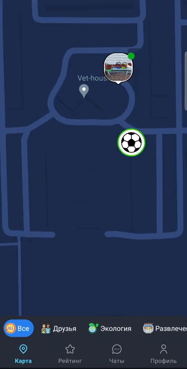
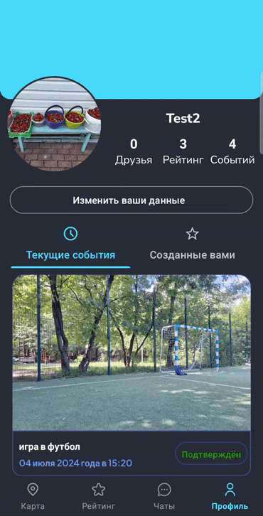

---

# 🌍 Lipe — создавайте события, находите друзей, помогайте природе

**Lipe** — это мобильное приложение, которое помогает пользователям находить единомышленников, создавать и присоединяться к событиям, а также участвовать в решении экологических проблем.

---

## 🚀 Основная идея

Вы когда-нибудь хотели собрать друзей, чтобы провести время с пользой, например, помочь в уборке мусора, или просто найти компанию для игры в волейбол? **Lipe** решает эту проблему, объединяя людей по интересам и помогая взаимодействовать друг с другом в режиме реального времени.

---

## 🎯 Основной функционал

### Карта событий

- На карте отображаются события, созданные пользователями.
- Доступно три типа событий:
    - **Экология** (например, уборка мусора).
    - **Развлечения** (игры, мероприятия).
    - **Помощь** (платные услуги или волонтерство).
- Каждое событие имеет уникальный значок (например, мяч для волейбола или значок планеты для экологических мероприятий).

### Функции для удобства:

- Реальное отображение местоположения друзей.
- Информация о друге (никнейм, имя, заряд телефона) доступна по нажатию на аватарку.
- Фильтрация карты по категориям (например, отображение только друзей или только событий).

### Группы и чаты

- Для каждого события автоматически создается группа, где участники могут общаться.
- Чаты для общения и обсуждения любых тем.

### Уведомления

- **Push-уведомления**:
    - О новых событиях в радиусе 10 км.
    - О заявках в друзья и других действиях.

### Профиль пользователя

- Отображение событий, на которые вы зарегистрировались или которые создали.
- Возможность редактировать информацию о себе.

### Рейтинг пользователей

- После завершения событий участники получают баллы.
- Баллы влияют на рейтинг, который помогает находить активных и надежных участников.

### Поддержка языков

- Приложение доступно на русском и английском языках. Язык интерфейса автоматически подстраивается под настройки телефона.

---

## 📦 Технологический стек

- **Frontend**: Kotlin, XML
- **Backend**: Ktor
- **База данных**: Firebase
- **Библиотеки**: Coil (для работы с изображениями)

---
## 🎆 Визуальное представление

